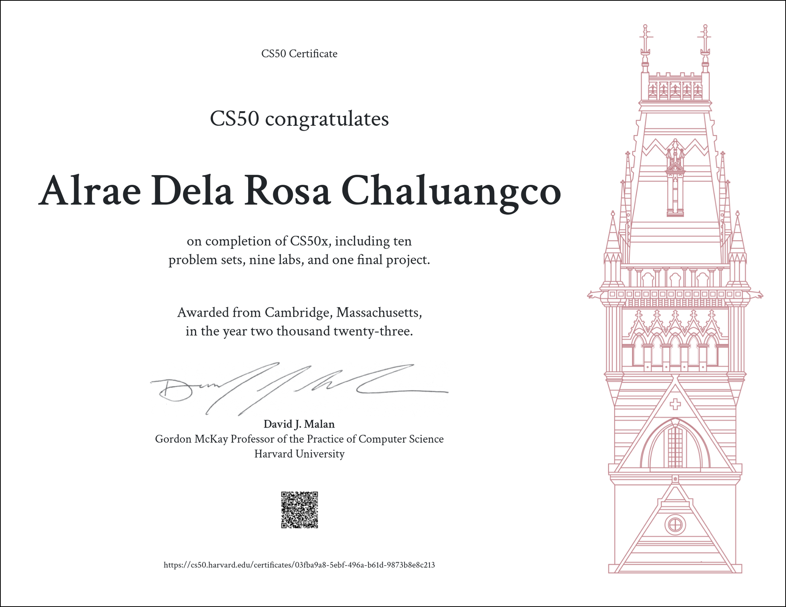

<h1>Technologies, Tools, and Stacks</h1>

### Integrated Development Environment

&nbsp;

### Programming Languages

&nbsp;

### Front - End Development

&nbsp;

### Back - End Development

&nbsp;

### Mobile

&nbsp;

### Databases

&nbsp;

### Dev Ops

&nbsp;

### Backend as a Service

&nbsp;

### Softwares , Version Control, Cybersecurity, and Hardware

&nbsp;

&nbsp;&nbsp;&nbsp;&nbsp;&nbsp;

&nbsp;

<h1 align="center"> AKCcoding at your service 🙇 </h1>

🕵🏻‍♂️ Core competencies to look out for :

✅ Responsible for keeping records and uses GIT version control system to manage and keep track of source codes changes/history and GITHUB for cloud-based data backups and repositories.

✅ Manages compelling interactive applications that are compatible with different platforms.

✅ Up to Date development tools and resources for maintaining maximum compatibility.

✅ Dedicated to resolve issues and troubleshoot/debug applications.

✅ Develops software effectively and code per specification with feasibility in mind.

- 🤔 I’m currently learning a lot of things including ReactJS, AngularJS, VueJS Frameworks for Web Development; Python, Java and C# for Backend Development.
- 🌱 I’m looking for an environment wherein I would be able to enhance my skills not just as individual but also as a Developer and Cybersecurity Engineer.
- 📸⚡🎥 My hobbies are photo editing and video editing.
- 🎮 I LOVE playing games when I have free time such as League of Legends highest peak(Challenger 500+lp), Valorant(Ascendant), Persona Series, Trading Card Games, MMORPGS
- 🥅 2023 Goals: Be more mature and responsible
- 👨🏻‍🎓🎓 Graduate and find a stable job to provide for my family's welfare.

