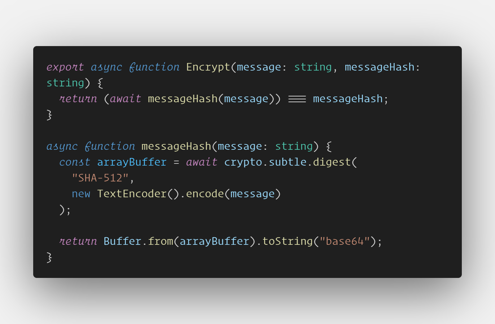

<h1 align="center">Technologies, Tools, and Stacks</h1>

### Front - End Development

&nbsp;

### Back - End Development

&nbsp;

&nbsp;

&nbsp;&nbsp;&nbsp;&nbsp;&nbsp;

<!--  -->

<!-- 

 -->

<h1 align="center"> Feel free to contact me 🙇 </h1>

- 🤔 Learning a lot of advanced things including ReactJS Library, NextJS for Dynamic Web Apps. Django, Flask and Spring Boot for Backend Development.
- 📸⚡🎥🏎️ My hobbies are troubleshooting PC, video editing, getting physically fit (GYM) and a YES to many road trips.
- 🎮 I LOVE Playing Online Games League of Legends, TFT, and Valorant.
- 🥅 2025 Goals: Sell Marketplace for $$$ so I can retire my parents.
